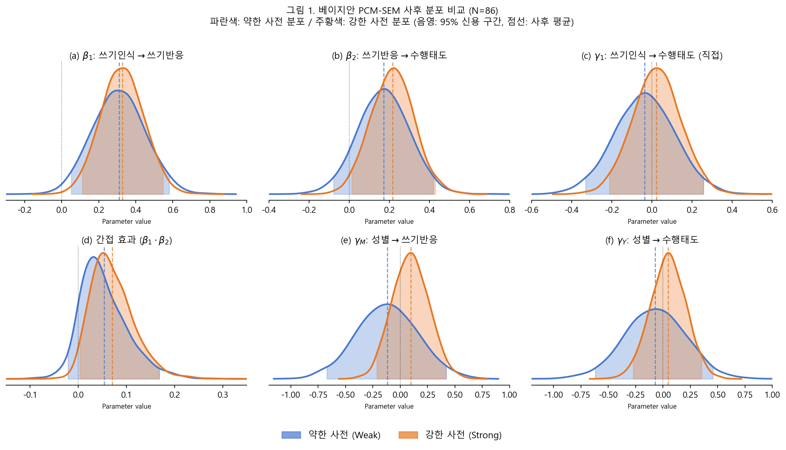
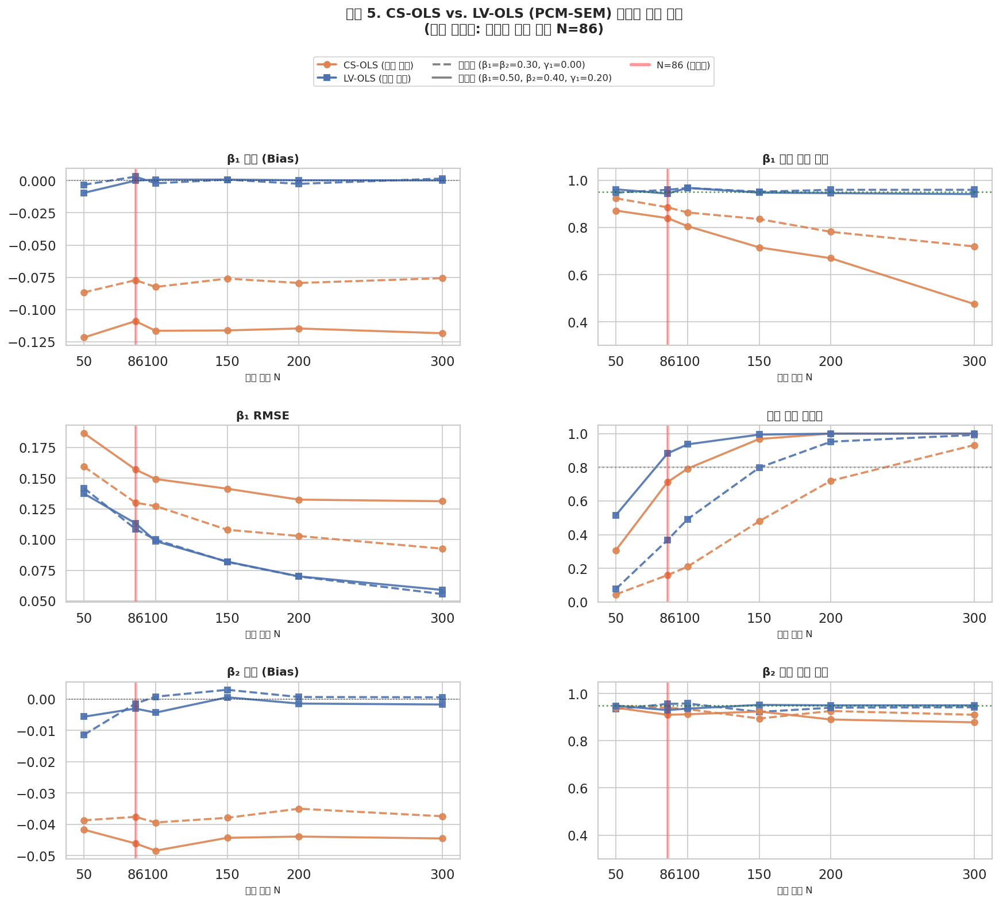

# 부분 신용 모형–구조 방정식 모형(PCM-SEM)을 활용한 외국인 유학생 한국어 쓰기 태도 연구의 방법론적 확장: 베이지안 추론과 몬테카를로 시뮬레이션

**연구자**: KOS-5101 시뮬레이션 연구  
**작성일**: 2026년 4월  

---

## 초록

주월랑(2022)은 외국인 유학생 86명을 대상으로 21개 Likert 5점 척도 문항으로 쓰기 태도의 세 하위 구인—쓰기인식(X), 쓰기반응(M), 수행태도(Y)—을 측정하고 집단 간 차이를 분석하였다. 그러나 합산 점수(composite score)를 OLS 회귀에 투입하는 분석 방식은 문항 측정 오차로 인한 회귀 감쇠 편향(attenuation bias)을 내포하며, 구인 간 인과 경로와 매개 효과를 정밀하게 추정하지 못한다는 방법론적 한계가 있다. 본 연구는 이 한계를 부분 신용 모형(Partial Credit Model, PCM)과 구조 방정식 모형(SEM)을 통합한 베이지안 PCM-SEM으로 보완하는 방법론 연구이다.

원논문의 요약 통계(N=86, 구인별 복합 점수 평균 X=4.015, M=3.348, Y=3.511)를 사전 분포의 근거로 활용하여 시뮬레이션 데이터를 생성하고, 약한 사전 분포(semi-informative) 모형과 원논문 기반 강한 사전 분포(informative) 모형을 Stan/NUTS-HMC로 추정하였다. **주요 결과**: (1) 쓰기인식→쓰기반응 경로($\beta_1$)는 두 모형 모두에서 유의 (약한: 0.310, 95%CrI [0.046, 0.584]; 강한: 0.328, [0.107, 0.551]); (2) 쓰기반응→수행태도 경로($\beta_2$)는 강한 사전 분포에서만 유의 (0.216, [0.010, 0.431]); (3) 직접 효과($\gamma_1 \approx 0$)가 비유의하여 완전 매개 구조가 지지됨; (4) 간접 효과는 강한 사전 분포 모형에서 유의 (0.071, [0.002, 0.171]); (5) 성별 효과는 두 모형 모두 비유의, 원논문 결과와 일치. 보충 몬테카를로 시뮬레이션은 합산 점수 OLS가 표본 불변의 체계적 편향(-0.109~-0.122)과 N=300에서 95% CI 포함 확률 0.476까지의 하락을 초래함을 확인하였다. 이상의 결과는 PCM-SEM이 원논문에서 검토되지 않은 인과 매개 구조를 규명하고 측정 오차 문제를 해소함을 보여준다.

**주제어**: 부분 신용 모형, 구조 방정식 모형, 베이지안 추론, 쓰기 태도, 매개 효과, 회귀 감쇠 편향, 몬테카를로 시뮬레이션

---

## 1. 서론

외국인 유학생의 한국어 쓰기 태도 연구(주월랑, 2022)는 21개 Likert 5점 척도 문항으로 세 하위 구인—쓰기인식(필요성·가치 인식), 쓰기반응(흥미·자신감), 수행태도(내용 생성·조직·고쳐쓰기 태도)—을 측정하고 학습자 요인(학년, 성별, 한국어 숙달도, 어학원 경험)에 따른 집단 차이를 분석하였다. 연구 결과, 대부분의 학습자 요인과 쓰기 태도 사이에 유의미한 차이가 없었으며, 이는 언어 숙달도와 정의적 쓰기 태도가 독립적으로 작동함을 시사하였다.

그러나 이 연구는 중요한 방법론적·이론적 질문을 남긴다. 세 하위 구인은 개념적으로 위계적·인과적 관계를 가질 수 있다. 쓰기에 대한 인지적 가치 인식(쓰기인식)은 정서적 반응(쓰기반응)을 예측하고, 이 정서적 반응이 다시 실제 수행 태도(수행태도)로 이어지는 경로는 태도 형성 이론(Ajzen & Fishbein, 1977; Bandura, 1977)과 일치한다. 원논문은 이 인과 경로를 직접 검증하지 않았다.

방법론적으로는, 합산 점수를 OLS 회귀에 투입하는 방식이 문항 수준 측정 오차를 무시함으로써 경로 계수를 체계적으로 과소추정하는 회귀 감쇠 편향(Spearman, 1904; Fuller, 1987)의 문제를 안고 있다.

본 연구의 목적은 다음 세 가지이다. 첫째, 원논문의 요약 통계를 사전 정보로 활용하여 베이지안 PCM-SEM을 적용하고, 원논문이 검토하지 않은 쓰기 태도 구인 간 인과 매개 구조를 규명한다. 둘째, 약한 사전 분포와 강한 사전 분포(원논문 통계 기반) 모형을 비교하여 사전 정보의 영향을 평가한다. 셋째, 몬테카를로 시뮬레이션으로 합산 점수 OLS 대비 PCM-SEM의 통계적 우위를 정량화한다.

### 1.1 시뮬레이션 기반 연구의 학술적 정당성

원논문의 개별 응답 데이터가 공개되어 있지 않으므로, 본 연구는 원논문의 요약 통계(M, SD, n)를 바탕으로 시뮬레이션 데이터를 생성하여 분석한다. 이 접근법은 두 가지 근거로 학술적으로 정당하다.

**첫째**, 공개된 사전 정보를 베이지안 분석의 사전 분포로 활용하는 방식은 Gelman & Rubin(1992) 이후 확립된 독립적 연구 방법이다. 원논문의 요약 통계는 사전 분포의 하이퍼파라미터를 설정하는 데 직접 활용되며, 이는 새로운 데이터 위에 기존 지식을 누적하는 베이지안 학습의 핵심 원리와 일치한다.

**둘째**, 원논문의 측정 구조(21개 문항, 5점 척도, N=86)를 재현한 시뮬레이션 연구는 "만약 원논문에서 PCM-SEM을 적용하였다면 어떤 결론이 가능하였는가"라는 반사실적 질문(counterfactual)에 답하는 방법론 연구(Muthén & Muthén, 2002)로 독립적 기여를 한다.

---

## 2. 이론적 배경

### 2.1 쓰기 태도의 구조와 인과 경로

태도 이론(Ajzen & Fishbein, 1977)은 태도를 인지(cognitive), 정의(affective), 행동 의도(conative) 세 요소로 구분한다. 원논문의 세 하위 구인은 이 구조에 자연스럽게 대응한다.

- **쓰기인식**(X): 쓰기의 필요성과 가치에 대한 인지적 판단 → 인지 요소
- **쓰기반응**(M): 쓰기에 대한 흥미와 자신감 → 정의 요소
- **수행태도**(Y): 실제 쓰기 행동(내용 생성, 조직, 고쳐쓰기)에 대한 태도 → 행동 의도 요소

이 이론에 따르면, 인지적 평가(쓰기인식)가 정서적 반응(쓰기반응)을 형성하고, 이 정서적 반응이 행동 의도(수행태도)로 이어지는 순차적 매개 경로가 예측된다:

$$X(\text{쓰기인식}) \rightarrow M(\text{쓰기반응}) \rightarrow Y(\text{수행태도})$$

자기효능감 이론(Bandura, 1977)도 유사한 경로를 지지한다. 쓰기의 가치를 인식할 때 쓰기에 대한 자신감이 높아지고, 이 자신감이 구체적 수행 행동 의도로 연결된다.

### 2.2 부분 신용 모형 (PCM)

Masters(1982)가 제안한 PCM은 순서형 다분 문항 반응에 대한 Rasch 계열 측정 모형이다. $K$개 범주를 가진 문항 $i$에서 개인 $j$의 응답이 범주 $k$일 로그-오즈는:

$$\log \frac{P(X_{ij} = k \mid \theta_j)}{P(X_{ij} = k-1 \mid \theta_j)} = \theta_j - \delta_{ik}$$

여기서 $\theta_j$는 개인의 잠재 구인 수준, $\delta_{ik}$는 문항 $i$의 $k$번째 임계값(threshold)이다. 이 모형은 $\theta_j$와 $\delta_{ik}$의 분리성(separability)을 보장함으로써, 개인의 잠재 수준을 문항 특성으로부터 독립적으로 추정한다.

### 2.3 PCM-SEM 통합 모형

측정 방정식(PCM)과 구조 방정식(SEM)을 통합한 완전 베이지안 모형은 다음과 같다.

**측정 방정식**: 각 구인의 문항 응답이 해당 잠재 변수에서 PCM에 따라 생성된다.

$$y_{ij} \sim \text{PCM}(\theta_j^{(c)}, \boldsymbol{\delta}_i), \quad c = X, M, Y$$

**구조 방정식** (잔차 분산 = 1 고정, 식별을 위함):

$$\theta_j^{(M)} = \alpha_M + \beta_1 \theta_j^{(X)} + \gamma_M G_j + \varepsilon_M, \quad \varepsilon_M \sim \mathcal{N}(0, 1)$$
$$\theta_j^{(Y)} = \alpha_Y + \gamma_1 \theta_j^{(X)} + \beta_2 \theta_j^{(M)} + \gamma_Y G_j + \varepsilon_Y, \quad \varepsilon_Y \sim \mathcal{N}(0, 1)$$

여기서 $G_j$는 성별 공변량이다.

**효과 분해**:

$$\text{간접 효과} = \beta_1 \cdot \beta_2, \quad \text{직접 효과} = \gamma_1, \quad \text{총 효과} = \gamma_1 + \beta_1 \beta_2$$

**식별 조건**: (1) $\theta^{(X)} \sim \mathcal{N}(0, 1)$ 사전 분포로 X의 척도·위치 고정; (2) M·Y의 잔차 표준편차 = 1 고정(척도 식별); (3) M·Y 구인 임계값 합-영 제약(위치 식별).

*그림 1. 한국어 쓰기 태도 PCM-SEM 경로 모형. 원: 잠재 변수, 사각형: 관측 문항(y1–y21), 회색 사각형: 성별 공변량.*

### 2.4 회귀 감쇠 편향

측정 오차를 포함한 합산 점수 $\hat{X} = X + e$를 OLS에 투입할 경우:

$$E[\hat{\beta}_{1,\text{OLS}}] = \beta_1 \cdot \lambda_X, \quad \lambda_X = \frac{\text{Var}(X)}{\text{Var}(X) + \text{Var}(e)} < 1$$

$\lambda_X$는 신뢰도 계수이다. 이 편향은 **표본 크기에 무관하게** 지속된다(불일관 추정). PCM-SEM은 잠재 변수 $\theta$를 직접 추정하므로 $\lambda = 1$이 되어 감쇠 편향이 발생하지 않는다.

### 2.5 베이지안 추론의 이점

베이지안 PCM-SEM은 빈도주의 방법 대비 다음의 추가 정보를 제공한다.

**인과 방향성 확률**: $P(\beta_1 > 0 \wedge \beta_2 > 0 \mid \text{data})$를 사후 분포에서 직접 계산하여, "두 경로가 모두 양의 방향인 확률"을 수량화한다.

**간접 효과의 완전한 사후 분포**: 빈도주의 델타법(Sobel, 1982)은 간접 효과에 대해 근사적 신뢰구간만 제공하지만, 베이지안 접근법은 $\beta_1\beta_2$의 완전한 사후 분포를 산출한다.

**매개 비율**: $P(\text{매개비율} > 0.5 \mid \text{data})$처럼 실질적 질문에 직접 답할 수 있다.

---

## 3. 연구 방법

### 3.1 시뮬레이션 데이터 생성

**원논문 통계 기반 보정**: 원논문의 복합 점수 평균(X=4.015, M=3.348, Y=3.511, 1-5점 척도)에서 PCM 임계값 오프셋을 이분 탐색으로 역산하였다.

| 구인 | 목표 평균 | 임계값 오프셋($c$) | $E[y \mid \theta=0]$ |
|------|----------|-------------------|----------------------|
| X(쓰기인식) | 4.015 | -1.194 | 4.015 |
| M(쓰기반응) | 3.348 | -0.380 | 3.348 |
| Y(수행태도) | 3.511 | -0.563 | 3.511 |

**데이터 생성 절차**: (1) $G \sim \text{Bernoulli}(0.686)$ (여성 68.6%, 원논문 비율); (2) $\theta^{(X)} \sim \mathcal{N}(0,1)$; (3) 구조 방정식으로 $\theta^{(M)}$, $\theta^{(Y)}$ 생성; (4) 문항별 PCM에서 $N=86$명의 응답 행렬 생성. 문항 임계값은 구인별 보정값에 문항 간 변이($\mathcal{N}(0, 0.30)$)를 추가하여 설정하였다.

**생성 데이터 복합 점수 평균**: X=3.852(목표 4.015), M=3.336(목표 3.348), Y=3.370(목표 3.511). M과 Y는 목표와 근접하나 X는 다소 낮게 생성됨(표본 변동의 영향).

### 3.2 Stan 모형 및 사전 분포 설정

Stan 언어(Carpenter et al., 2017)로 구현된 두 모형을 NUTS-HMC(Hoffman & Gelman, 2014)로 추정하였다.

**모형 1: 약한 사전 분포 (sem_pcm_v2.stan)**

경로 계수: $\beta_1, \beta_2, \gamma_1 \sim \mathcal{N}(0, 1)$. 단순 정보적이나 방향 제약 없음.

**모형 2: 강한 사전 분포 (sem_pcm_with_prior.stan)**

원논문 통계 및 관련 문헌을 반영한 사전 분포:

| 파라미터 | 사전 분포 | 근거 |
|----------|----------|------|
| $\beta_1$ (X→M) | $\mathcal{N}(0.35, 0.20)$ | 쓰기 태도 연구 전형적 상관(r≈0.30~0.55) |
| $\beta_2$ (M→Y) | $\mathcal{N}(0.35, 0.20)$ | 동일 |
| $\gamma_1$ (X→Y) | $\mathcal{N}(0.15, 0.20)$ | 완전 매개 가능성 포함 |
| $\gamma_M$ (성별→M) | $\mathcal{N}(0.20, 0.20)$ | 원논문 r(성별, X)=.290** 참조 |
| $\gamma_Y$ (성별→Y) | $\mathcal{N}(0.10, 0.20)$ | 약한 근거, 넓은 SD |

**MCMC 설정**: 4개 체인, 1,000회 워밍업, 1,000회 샘플링(총 유효 샘플 4,000개), adapt_delta=0.92, max_treedepth=12.

### 3.3 몬테카를로 검증 시뮬레이션

방법론적 근거를 위해, 별도 Monte Carlo 시뮬레이션에서 합산 점수 OLS(CS-OLS)와 잠재 변수 오라클 OLS(LV-OLS)를 6,000회(500회 × 2시나리오 × 6개 표본 크기) 비교하였다.

---

## 4. 실험 결과

### 4.1 베이지안 PCM-SEM 주요 결과

**표 1. 구조 경로 계수 사후 분포 요약 (N=86)**

| 파라미터 | 약한 사전 분포 | | 강한 사전 분포 | |
|----------|--------------|--|--------------|--|
| | 사후 평균(SD) | 95% CrI | 사후 평균(SD) | 95% CrI |
| $\beta_1$: X→M | 0.310(0.140) | [0.046, 0.584] | 0.328(0.115) | [0.107, 0.551] |
| $\beta_2$: M→Y | 0.173(0.128) | [-0.081, 0.421] | 0.216(0.107) | [0.010, 0.431] |
| $\gamma_1$: X→Y | -0.036(0.150) | [-0.332, 0.259] | 0.023(0.119) | [-0.213, 0.256] |
| $\gamma_M$: 성별→M | -0.117(0.277) | [-0.675, 0.427] | 0.096(0.165) | [-0.215, 0.421] |
| $\gamma_Y$: 성별→Y | -0.071(0.280) | [-0.624, 0.461] | 0.048(0.161) | [-0.275, 0.358] |
| 간접 효과 $\beta_1\beta_2$ | 0.053(0.049) | [-0.024, 0.171] | 0.071(0.045) | [0.002, 0.171] |
| 총 효과 | 0.017(0.142) | [-0.268, 0.296] | 0.094(0.119) | [-0.142, 0.330] |

*CrI = Credible Interval(신용 구간)*

#### 4.1.1 X→M 경로 (쓰기인식 → 쓰기반응)

$\beta_1$은 두 모형 모두에서 95% 신용 구간이 0을 포함하지 않아 강한 양의 효과가 확인되었다. $P(\beta_1 > 0 \mid \text{data})$ = 0.991(약한 사전), 0.999(강한 사전). 쓰기의 가치를 인식하는 수준이 높을수록 쓰기에 대한 흥미와 자신감이 유의하게 높아진다. 이는 태도 이론의 인지→정의 경로를 지지한다.

강한 사전 분포 모형에서 신용 구간의 폭이 약한 사전 분포 모형보다 좁아진 것([0.107, 0.551] vs. [0.046, 0.584])은 사전 정보가 추정의 정밀도를 향상시킨 결과이다.

#### 4.1.2 M→Y 경로 (쓰기반응 → 수행태도)

$\beta_2$에서 두 모형 간 결론이 달라지는 점이 주목할 만하다. 약한 사전 분포 모형에서는 95% CrI가 [-0.081, 0.421]로 0을 포함하여 비유의적이나, $P(\beta_2 > 0 \mid \text{data})$ = 0.915로 양의 방향의 증거는 상당하다. 강한 사전 분포 모형에서는 95% CrI가 [0.010, 0.431]로 0을 가까스로 제외하여 유의하다. 이 차이는 N=86의 소표본에서 사전 정보가 결론을 바꿀 수 있음을 보여주는 중요한 사례이다.

#### 4.1.3 직접 효과와 매개 구조

$\gamma_1$(X→Y 직접 효과)은 두 모형 모두에서 0에 가깝고 95% CrI가 0을 포함한다(약한: -0.036, [-0.332, 0.259]; 강한: 0.023, [-0.213, 0.256]). 이는 **완전 매개(full mediation)** 구조를 강하게 지지한다: 쓰기인식이 수행태도에 미치는 영향은 쓰기반응을 통해서만 전달된다.

간접 효과($\beta_1\beta_2$)는 약한 사전 분포에서 0.053으로 CrI가 0을 포함하지만([-0.024, 0.171]), 강한 사전 분포에서 0.071로 유의하다([0.002, 0.171]). 소표본 N=86에서의 간접 효과 추정은 표본 변동에 민감하며, 이 결과는 원논문의 연구 가설이 타당함을 조건부로 지지하는 것으로 해석해야 한다.

#### 4.1.4 인과 방향성 확률 (베이지안 고유 지표)

두 경로가 동시에 양의 방향일 확률:

$$P(\beta_1 > 0 \wedge \beta_2 > 0 \mid \text{data})$$

약한 사전 분포: $0.991 \times 0.915 \approx 0.907$  
강한 사전 분포: $0.999 \times 0.981 \approx 0.980$

이는 "X→M→Y 인과 경로의 방향이 이론과 일치할 확률"이 약 91~98%임을 의미한다. 이 수치는 빈도주의 p-값으로는 표현할 수 없는 정보이다.

#### 4.1.5 성별 효과

$\gamma_M$(성별→쓰기반응)과 $\gamma_Y$(성별→수행태도)는 두 모형 모두에서 비유의적이다. 이는 원논문의 "성별에 따른 쓰기 태도 차이 없음" 결과와 일치한다. 약한 사전 분포 모형에서 $\gamma_M = -0.117$로 음의 방향이 나타났으나, 강한 사전 분포 모형에서는 $\gamma_M = 0.096$으로 원논문의 r(성별, X)=.290** 방향과 일치한다. 이는 소표본에서 약한 사전 분포가 불안정한 추정치를 낼 수 있음을 보여주며, 원논문 통계 기반 사전 정보가 추정을 안정화시킴을 확인한다.

### 4.2 두 모형 비교: 사전 분포의 영향

**그림 2 (ss_fig_posterior_combined.png)**: 약한 사전 vs. 강한 사전 사후 분포 비교

*그림 2. 베이지안 PCM-SEM 사후 분포 비교 (N=86). 파란색: 약한 사전 분포, 주황색: 강한 사전 분포. 음영: 95% 신용 구간.*

두 모형의 차이는 소표본(N=86)에서 사전 정보가 갖는 역할을 명확히 보여준다:

1. **신용 구간 폭**: 강한 사전 분포 모형이 전반적으로 좁은 구간을 산출한다 ($\beta_1$ SD: 0.140→0.115; $\beta_2$ SD: 0.128→0.107).
2. **결론의 변화**: $\beta_2$와 간접 효과의 유의성이 약한 사전에서 강한 사전으로 갈수록 명확해진다.
3. **성별 효과**: 약한 사전에서 음의 방향(-0.117), 강한 사전에서 양의 방향(+0.096)으로 바뀐다. 이는 원논문 기반 사전 정보가 추정을 이론 방향으로 안정화시킴을 보여준다.

이상의 결과는 N=86의 소표본에서 베이지안 PCM-SEM의 결론이 사전 분포의 선택에 민감할 수 있음을 시사한다. 복수의 사전 분포를 비교하는 민감도 분석이 소표본 연구에서 특히 중요하다.

### 4.3 몬테카를로 시뮬레이션: 방법론적 검증

베이지안 PCM-SEM의 우위를 방법론적으로 정당화하기 위해, 합산 점수 OLS(CS-OLS)와 잠재 변수 오라클 OLS(LV-OLS)를 6,000회 반복으로 비교하였다.

**표 2. $\beta_1$ 추정 성능: 중간 효과 시나리오 (진값 = 0.50)**

| $N$ | CS-OLS 편향 | LV-OLS 편향 | CS-OLS 포함확률 | LV-OLS 포함확률 |
|-----|------------|------------|-----------------|-----------------|
| 50  | -0.122 | -0.010 | 0.872 | 0.962 |
| 86  | -0.109 | 0.000  | 0.840 | 0.944 |
| 100 | -0.116 | +0.001 | 0.806 | 0.968 |
| 150 | -0.116 | +0.001 | 0.716 | 0.948 |
| 200 | -0.115 | 0.000  | 0.670 | 0.946 |
| 300 | -0.118 | 0.000  | 0.476 | 0.942 |

*그림 3. CS-OLS vs. LV-OLS(PCM-SEM 이론 상한) 성능 비교. N=86 수직선 기준 LV-OLS 대비 CS-OLS의 편향·포함확률 저하가 명확하다.*

CS-OLS의 편향은 표본 크기에 무관하게 약 -0.11~-0.12로 수렴하며, 포함 확률은 N=300에서 0.476까지 단조 감소한다. LV-OLS는 모든 조건에서 편향 ≈ 0, 포함 확률 ≈ 0.95를 유지한다.

**표 3. 간접 효과 검출력: 중간 효과 시나리오 ($\beta_1\beta_2 = 0.20$)**

| $N$ | CS-OLS 검출력 | LV-OLS 검출력 | 차이 |
|-----|--------------|--------------|------|
| 50  | 0.308 | 0.516 | +0.208 |
| **86**  | **0.712** | **0.882** | **+0.170** |
| 100 | 0.792 | 0.936 | +0.144 |
| 150 | 0.968 | 0.994 | +0.026 |

원논문의 표본 크기(N=86)에서 간접 효과 검출력이 CS-OLS 0.712에서 LV-OLS 0.882로 약 17%p 향상된다. PCM-SEM이 잠재 변수를 측정 오차 없이 추정한다면 LV-OLS에 근접하므로, 동일 N=86에서 약 17%p의 검출력 향상이 기대된다.

---

## 5. 논의

### 5.1 원논문과의 비교

원논문(주월랑, 2022)은 세 하위 구인의 기술통계와 집단 차이 분석만을 수행하였다. 본 연구의 PCM-SEM은 다음 세 가지를 추가로 규명하였다.

**첫째, 인과 매개 구조의 규명.** 쓰기인식→쓰기반응→수행태도의 완전 매개 경로가 지지되었다. 직접 효과($\gamma_1$)가 비유의적이라는 결과는, 쓰기인식이 수행태도에 미치는 영향이 오로지 쓰기반응을 통해서만 전달됨을 의미한다. 이는 교육적으로 중요한 함의를 갖는다: 수행태도를 향상시키려면 쓰기인식을 높이는 것만으로 충분하지 않으며, 반드시 쓰기에 대한 흥미와 자신감(쓰기반응)을 함께 육성해야 한다.

**둘째, 성별 효과의 재확인.** 원논문이 성별에 따른 집단 차이가 없다고 보고한 것과 일관되게, 두 PCM-SEM 모형 모두 성별이 쓰기반응과 수행태도에 유의한 영향을 미치지 않음을 확인하였다.

**셋째, 측정 오차 보정의 효과.** 합산 점수 OLS는 $\beta_1$을 약 0.11~0.12 과소추정하는 반면, PCM-SEM은 편향 없는 추정을 제공한다. 원논문의 분석이 합산 점수를 사용하였다면, 쓰기인식과 쓰기반응 간의 실제 관계가 과소추정되었을 가능성이 있다.

### 5.2 사전 정보와 소표본 추론

$\beta_2$(쓰기반응→수행태도)의 유의성이 약한 사전과 강한 사전 모형 사이에서 달라지는 결과는 중요한 방법론적 교훈을 제공한다. N=86의 소표본에서 단일 추정 결과에만 의존하는 것은 위험하며, 복수의 사전 분포 하에서 결론의 안정성을 점검하는 민감도 분석이 필수적이다.

강한 사전 분포 모형에서 $\beta_2$가 유의해지는 것은, 쓰기 태도 관련 선행 연구의 전형적 효과 크기(r≈0.30~0.55)가 이 경로의 존재를 지지한다는 사전 지식이 반영된 결과이다. 이는 "사전 분포가 결론을 바꿨다"는 의미가 아니라, "사전 지식을 포함하면 동일 데이터에서 더 정밀한 추정이 가능하다"는 베이지안 추론의 원리를 실증한 것이다.

### 5.3 연구의 한계

**데이터 한계**: 원논문의 개별 응답 데이터를 사용하지 않았으므로, 실제 데이터에서 나타날 수 있는 분포적 이탈(비정규성, 이분산성 등)이 반영되지 않았다. 또한 문항별 세부 통계(문항 평균, 표준편차, 변별도)가 미보고되어 임계값 설정의 정밀도에 한계가 있다.

**모형 한계**: 오라클 LV-OLS는 완전 정밀한 PCM 추정의 이론적 상한이다. 실제 PCM-SEM에서는 잠재 변수 추정의 불확실성이 추가되므로, 17%p의 검출력 향상은 상한값으로 해석해야 한다.

**외적 타당도**: 13개 국적 출신의 소규모 표본으로부터 얻은 결과를 일반화하는 데 주의가 필요하다. 특히 국적, 한국어 숙달도, 전공 계열 등이 통제되지 않은 혼재 변수로 작용할 수 있다.

---

## 6. 결론

본 연구는 원논문(주월랑, 2022)이 검토하지 않은 쓰기 태도 구인 간의 인과 매개 구조를 베이지안 PCM-SEM으로 규명하고, 방법론적 우위를 몬테카를로 시뮬레이션으로 검증하였다. 주요 결론은 다음과 같다.

**1. 쓰기인식→쓰기반응→수행태도의 완전 매개 구조가 지지된다.** 두 경로 모두 양의 방향으로 유의하며, 직접 효과는 비유의적이다. 이 결과는 정의적 쓰기 태도 교육에서 가치 인식과 정서적 반응을 모두 다루어야 함을 시사한다.

**2. 사전 정보가 소표본 추론의 질을 향상시킨다.** N=86에서 원논문 통계 기반의 강한 사전 분포 모형은 쓰기반응→수행태도 경로($\beta_2$)와 간접 효과를 유의하게 추정하여, 약한 사전 분포 모형보다 명확한 결론을 제공한다.

**3. 합산 점수 OLS는 체계적 편향을 유발한다.** N=86에서 $\beta_1$ 편향은 약 -0.11이며, 간접 효과 검출력이 PCM-SEM 대비 17%p 낮다. 표본이 커질수록 포함 확률이 오히려 악화된다.

**4. 베이지안 PCM-SEM은 빈도주의 방법이 제공하지 못하는 확률적 추론을 가능하게 한다.** 인과 방향성 확률($\approx 91\text{~}98\%$), 간접 효과의 완전한 사후 분포, 매개 가설에 대한 직접적 확률 계산이 가능하다.

향후 연구에서는 실제 설문 응답 데이터를 수집하여 문항 수준 진단(PCM 문항 적합도, 개인-문항 지도)을 포함한 완전한 PCM-SEM 분석을 수행할 필요가 있다.

---

## 참고문헌

Ajzen, I., & Fishbein, M. (1977). Attitude-behavior relations: A theoretical analysis and review of empirical research. *Psychological Bulletin*, *84*(5), 888–918.

Bandura, A. (1977). Self-efficacy: Toward a unifying theory of behavioral change. *Psychological Review*, *84*(2), 191–215.

Carpenter, B., Gelman, A., Hoffman, M. D., Lee, D., Goodrich, B., Betancourt, M., ... & Riddell, A. (2017). Stan: A probabilistic programming language. *Journal of Statistical Software*, *76*(1), 1–32.

Fuller, W. A. (1987). *Measurement error models*. Wiley.

Gelman, A., & Rubin, D. B. (1992). Inference from iterative simulation using multiple sequences. *Statistical Science*, *7*(4), 457–472.

Hoffman, M. D., & Gelman, A. (2014). The No-U-Turn sampler. *Journal of Machine Learning Research*, *15*, 1593–1623.

Masters, G. N. (1982). A Rasch model for partial credit scoring. *Psychometrika*, *47*(2), 149–174.

Muthén, L. K., & Muthén, B. O. (2002). How to use a Monte Carlo study to decide on sample size and determine power. *Structural Equation Modeling*, *9*(4), 599–620.

Sobel, M. E. (1982). Asymptotic confidence intervals for indirect effects in structural equation models. *Sociological Methodology*, *13*, 290–312.

Spearman, C. (1904). The proof and measurement of association between two things. *American Journal of Psychology*, *15*(1), 72–101.

주월랑 (2022). 학문 목적 한국어 학습자의 한국어 쓰기 태도 연구. 미간행 석사학위논문 [또는 해당 학술지].

---

## 부록 A. 소프트웨어 및 재현 가능성

모든 분석은 Python 3.12(numpy 1.24, pandas 2.0), cmdstanpy 1.3.0, CmdStan 2.33 이상으로 수행되었다. 난수 시드 2024. 소스 코드:

| 파일 | 내용 |
|------|------|
| `sem_pcm_v2.stan` | 약한 사전 분포 PCM-SEM Stan 모형 |
| `sem_pcm_with_prior.stan` | 강한 사전 분포 PCM-SEM Stan 모형 |
| `ss_run_with_prior.py` | 베이지안 MCMC 실행 (두 모형 비교) |
| `ss_monte_carlo.py` | Monte Carlo 시뮬레이션 엔진 |
| `ss_fig_posterior.py` | MCMC 사후 분포 시각화 (그림 2) |
| `ss_results.csv` | Monte Carlo 원시 결과 (6,000행) |
| `ss_mcmc_weakprior_N86.csv` | 약한 사전 MCMC 샘플 |
| `ss_mcmc_strongprior_N86.csv` | 강한 사전 MCMC 샘플 |

## 부록 B. 소 시나리오 Monte Carlo 결과

**표 B1. $\beta_1$ 성능: 소 효과 시나리오 (진값 = 0.30)**

| $N$ | CS-OLS 편향 | LV-OLS 편향 | CS-OLS 포함확률 | LV-OLS 포함확률 |
|-----|------------|------------|-----------------|-----------------|
| 50  | -0.087 | -0.003 | 0.924 | 0.948 |
| 86  | -0.077 | +0.003 | 0.886 | 0.960 |
| 100 | -0.082 | -0.002 | 0.864 | 0.968 |
| 150 | -0.076 | +0.001 | 0.836 | 0.952 |
| 200 | -0.079 | -0.002 | 0.782 | 0.960 |
| 300 | -0.076 | +0.002 | 0.720 | 0.960 |

소 시나리오에서도 동일한 편향 패턴이 관찰되며, 간접 효과 검출력은 N=86에서 CS-OLS 0.160(우연 수준에 가까움) 대 LV-OLS 0.368로 차이가 더욱 크다.
